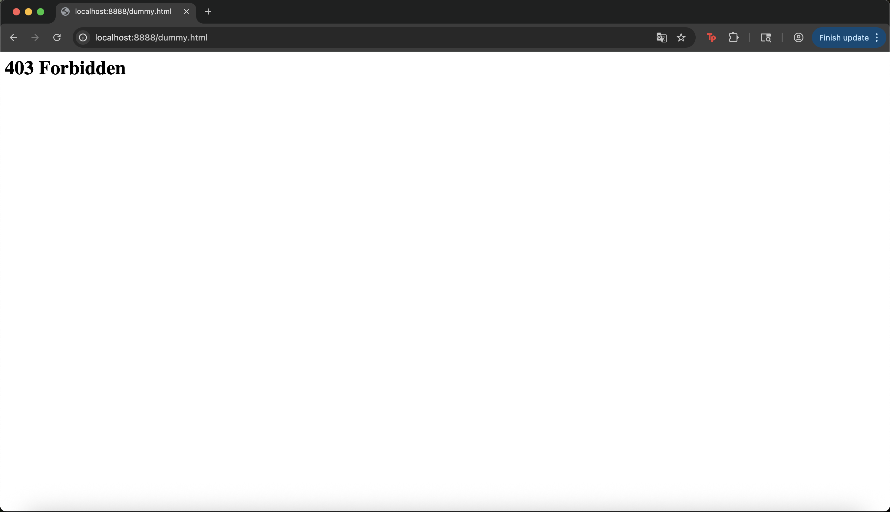

# Programming Assignment 1: HTTP Server in Python

**Name:** Ankush Chandrashekar

**SJSU ID:** 019106204

---

## Description
This assignment implements a ** multi-threaded HTTP server** using Python's built-in libraries.

The server:
- Listens on a user-specified port  
- Accepts multiple client connections simultaneously using threads  
- Serves static files from a specified document root  
- Supports HTTP/1.0 and HTTP/1.1 `GET` requests  
- Returns proper HTTP status codes (`200`, `400`, `403`, `404`)  
- Dynamically adjusts its socket timeout based on current thread activity

The dynamic timeout logic allows the server to become more responsive under high load while remaining stable during light load.

---

## Submitted Files
- `server.py` — main HTTP server implementation  
- `README.md` — documentation and demonstration guide  
- `sjsu` - Folder containing all the website files

---

## Instructions for Running the Program
### Requirements
- Python 3.8 or higher (standard library only)

### Steps
1. Open a terminal or command prompt in the project directory.
2. Run the server using:
   ```bash
   python3 server.py --document_root ./sjsu --port 8888
   ```
   *(You can change the path or port as desired.)*
3. Open your web browser and visit:
   ```
   http://localhost:8888/
   ```

---

## How It Works
1. The server accepts incoming connections using a main socket.
2. Each client is handled by a separate **thread**, allowing multiple users simultaneously.
3. Requests are parsed and responded to with appropriate headers and content.
4. If the request if of **HTTP/1.0** the connection is closed immediately
5. If the request if of **HTTP/1.1** the connection is maintained to wait for more requests
    ```python
    aliveCheck = versionCheck(version)

    cont= servePath(cSocket,version,target, aliveCheck)
    
    # the functionality to check to close the connetion or not based on HTTP/1.0 or HTTP/1.1
    # cont - variable to check whther to continue or close the connection
    if not cont:
        break
    ```
5. The timeout for client sockets is computed dynamically:
   ```python
   def computeTimeout():
       active = max(1, threading.active_count() - BASE_THREADS)
       min_timeout = 2
       max_timeout = 10

       if active <= 1:
           timeout = 5
       elif active <= 3:
           timeout = 3
       else:
           timeout = 3 - 1 * (active - 3)

       return max(min_timeout, min(max_timeout, timeout))
   ```

---

## Demonstration of Correct Implementation

### 1. Accessing an Existing File
**Request:**  
```
http://localhost:8888/index.html
```
**Expected Result:**  
The contents of `index.html` are displayed correctly.

---

### 2. Accessing a Non-existent File
**Request:**  
```
http://localhost:8888/missing.html
```
**Expected Result:**  
The browser displays a **404 Not Found** page.

---

### 3. Example Browser Screenshots
Please include the following screenshots in your submission folder:
- **Screenshot 1:** Browser showing `http://localhost:8888/index.html` served successfully.  


- **Screenshot 2:** Browser showing a `404 Not Found` error for a missing file.


- **Screenshot 3:** Browser showing a `403 Forbidden` error for a permission error file.

